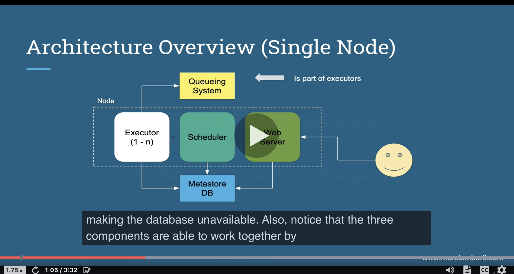
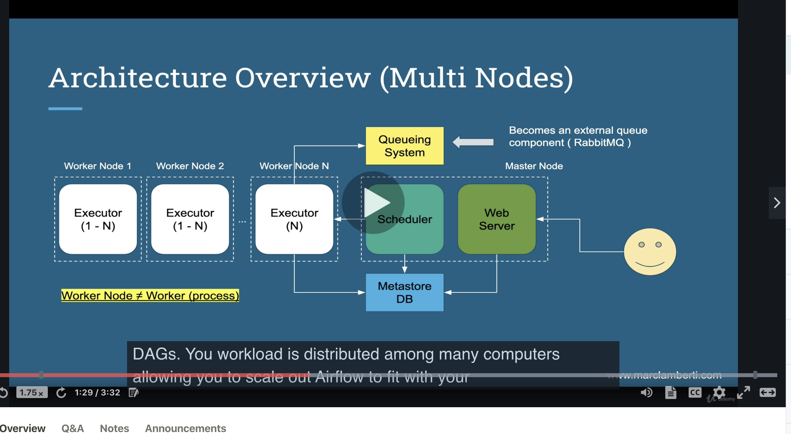
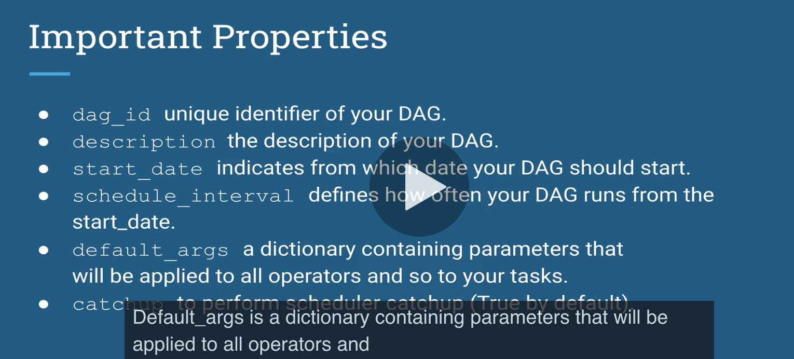
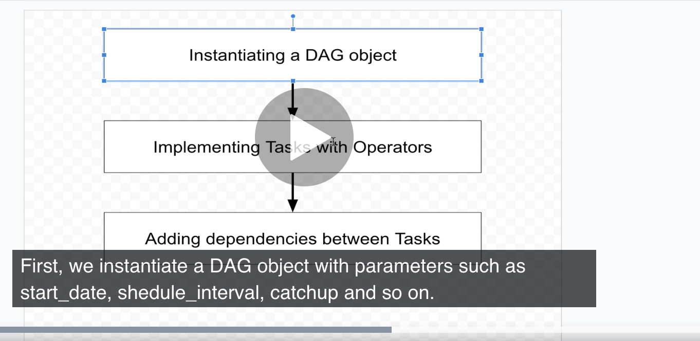

__What is airflow?__
programatically author and monitor data pipelines

Core components of airflow:
- unicorn server and flask and serves the UI dashboard
- scheduler: Daemon responsible for scheduling jobs.
- metadata database: all metadata related to admin and jobs  and must be supported by sqlalchemy library (mysql, oracle, postgres)
- executor: how tasks should be executed (kubernetes executor, local executor, etc.)
- worker: node in cluster executing our tasks.


Key concepts:
- DAG: acyclic graph object representing our data pipeline
- Operator: describes a single task in a DAG
- Task: instance of an operator.
- TaskInstance: represents a specific run of a task = DAG + task + point in time.
- worker node: computer
- worker: process of airflow


_What airflow gives you:_
- pipelines are configured via python code
- you have a graphical representation of your DAGs as well as metrics.
- Airflow is scalable with horizontally or vertically. 
- you can backfill and run a past task that failed. 
airflow is  NOT a data streaming solution. It's not spark or storm.
  

How airflow works:


- The queue is needed to execute tasks in the right order.
- in the diagram above, the executor, scheduler, web server are on the same node. The database is separate so in that in thee case of a machine failure, the database is still up and running. 
- The executor, scheduler, web server work together by exchanging data through the database.


This diagram is if you scale out airflow on many workers. The worker nodes contain the executors.

Steps of airflow:
- scheduler reads the DAG folder for a python file corresponding to a DAG
- dagrun object is created based on dag. It's an instance of our dag with state set to running.
- task instance is created and flagged to "scheduled" in the database.
- scheduler picks off task instances form hte database marked as "scheduled" and puts and changes state to queued and sends them to executors's queues. Remember, the queues are part of the executors. 
- executors task pulls tasks from queue and turn state from queued to running
- workers start processing the task instances.
- executor finishes task and sets task to finsihed in database.
- scheduler updates dag run to success if succeede or failed
- web server periodically pulls data from database to update the UI≥


__Basic commands:__

airflow initdb
	- When you change the database or install airflow for the first time:


airflow resetdb
	- Lose all data, fresh new install


airflow upgradedb
	- Upgrades metabase to new version
	- Initdb calls upgradedb


airflow webserver
	- -w can specify number of unicorn workers


airflow list_dags
	- list all dags that the scheduler is aware of.


airflow trigger_dag <dag_name>
- you need to first turn on the dag in the UI. This tells the scheduler that DAG can run.

airflow list_tasks <dag_name>


To clear a dag run:
- turn off toggle in UI so scheduler won't schedule it.
- click on `browse` in UI, type in dag you want to clear, select all associated tasks, and select clear.


It's neat to see that the execution is the day before:

```bash
DAG RUNS
------------------------------------------------------------------------------------------------------------------------
id  | run_id               | state      | execution_date       | state_date           |

6   | manual__2021-03-24T16:29:05.970723+00:00 | success    | 2021-03-24T16:29:05.970723+00:00 | 2021-03-24T16:29:05.976863+00:00 |
8   | scheduled__2021-03-23T00:00:00+00:00 | success    | 2021-03-23T00:00:00+00:00 | 2021-03-24T16:31:31.808686+00:00 |
7   | scheduled__2021-03-22T00:00:00+00:00 | success    | 2021-03-22T00:00:00+00:00 | 2021-03-24T16:29:50.303460+00:00 |
```

So if you trigger a dag, it runs immediately and I guess it records that it was run the day before at midnight.


### Section 3

- forex data pipeline will be built.


What is a DAG?
- finite directed graph with no directed cycles i.e., cannot wind up back at original nodel. no loops
- The Dag cannot be endless.

In airflow:
- Dag is a collection of tasks to schedule as well as their dependencies.
- node = task
- edge = dependency between N tasks.





If your start date is 1 year ago and your `schedule_interval` is daily, you'll wind up with 365 Dag runs.


these are the steps in writing a Dag:


__Operators__
To create an Airflow task, you need to create an operator

an operator says what actually gets done in a task.
- usually atomic, doesn't need to share resources with any other operators.
- can be on separate machines.
- Dag defines what order the operators are run.
- can trigger single task from CLI

key points:
- defines single task
- idempotent, same result no matter how many times run.
- task is defined by instantiating Operator class.
- when Operator is instantiated, it becomes node in Dag.


some default operators:
- BashOperator - executes a bash command
- PythonOperator - calls arbitrary python function.
- EmailOperator - sends an email

- All operators inherit from Base Operator
- There are 3 types:
    - Action Operators: perform an action (BashOperator, PythonOperator, EmailOperator)
    - Transfer Operators: move data from 1 system to another (StfpOPerator)
    - Sensor Operators: waiting for something to happen (FileSensor)
    
- TransferOperators: do not use if dealing with large data. Data pulled from source, staged on machine where executor is running, then transferred. 
- SensorOperator: you need to overwrite the `poke` method. It runs until it returns True. It's a long-running task.
