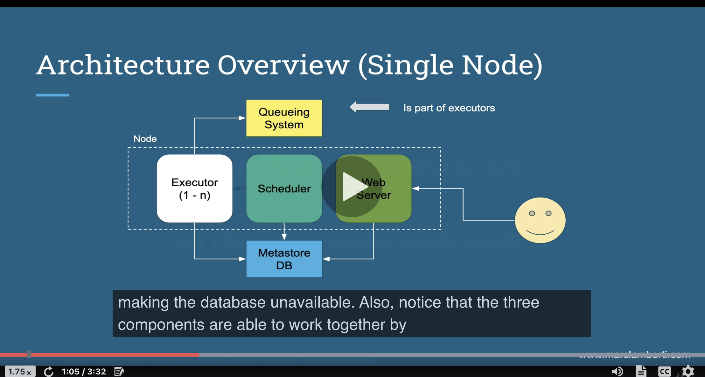
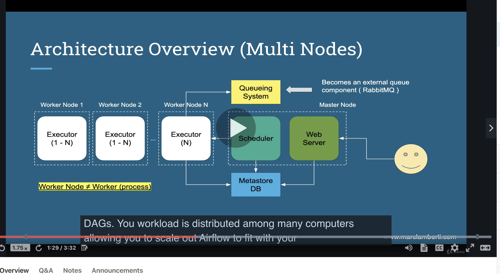

__What is airflow?__
programatically author and monitor data pipelines

Core components of airflow:
- unicorn server and flask and serves the UI dashboard
- scheduler: Daemon responsible for scheduling jobs.
- metadata database: all metadata related to admin and jobs  and must be supported by sqlalchemy library (mysql, oracle, postgres)
- executor: how tasks should be executed (kubernetes executor, local executor, etc.)
- worker: node in cluster executing our tasks.

Key concepts:
- DAG: acyclic graph object representing our data pipeline
- Operator: describes a single task in a DAG
- Task: instance of an operator.
- TaskInstance: represents a specific run of a task = DAG + task + point in time.
- worker node: computer
- worker: process of airflow

_What airflow gives you:_
- pipelines are configured via python code
- you have a graphical representation of your DAGs as well as metrics.
- Airflow is scalable with horizontally or vertically. 
- you can backfill and run a past task that failed. 
airflow is  NOT a data streaming solution. It's not spark or storm.
  

How airflow works:

- The queue is needed to execute tasks in the right order.
- in the diagram above, the executor, scheduler, web server are on the same node. The database is separate so in that in thee case of a machine failure, the database is still up and running. 
- The executor, scheduler, web server work together by exchanging data through the database.

This diagram is if you scale out airflow on many workers. The worker nodes contain the executors.

Steps of airflow:
- scheduler reads the DAG folder for a python file corresponding to a DAG
- dagrun object is created based on dag. It's an instance of our dag with state set to running.
- task instance is created and flagged to "scheduled" in the database.
- scheduler picks off task instances form hte database marked as "scheduled" and puts and changes state to queued and sends them to executors's queues. Remember, the queues are part of the executors. 
- executors task pulls tasks from queue and turn state from queued to running
- workers start processing the task instances.
- executor finishes task and sets task to finsihed in database.
- scheduler updates dag run to success if succeede or failed
- web server periodically pulls data from database to update the UI≥
