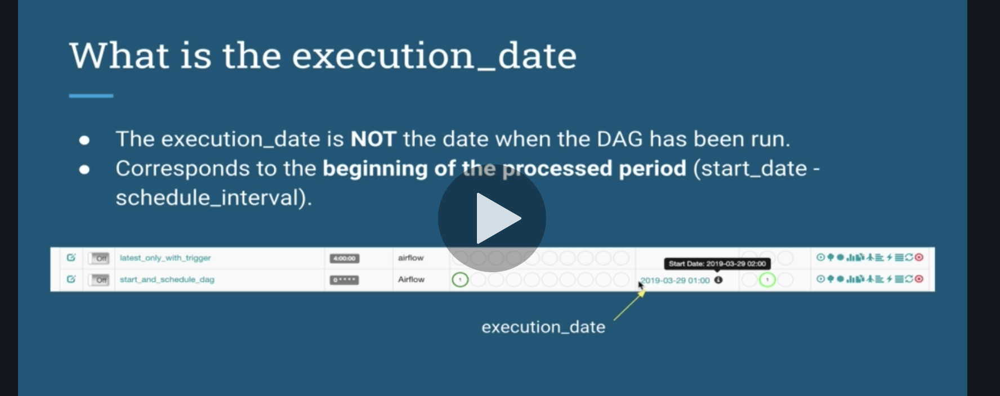
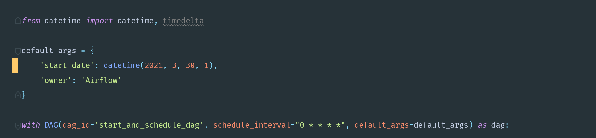
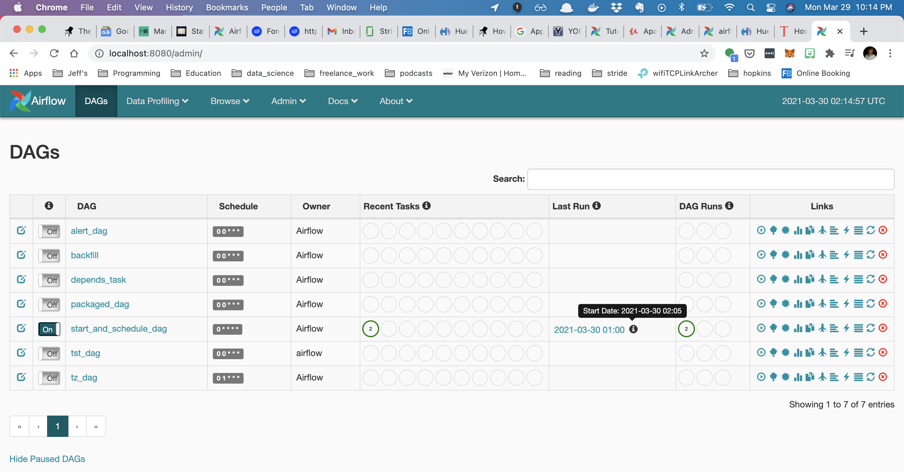
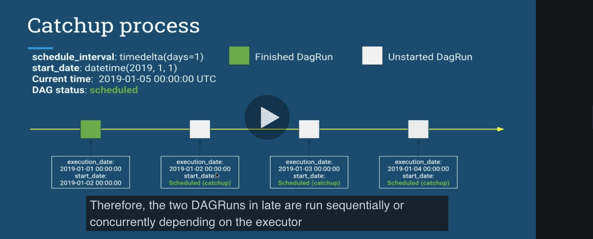
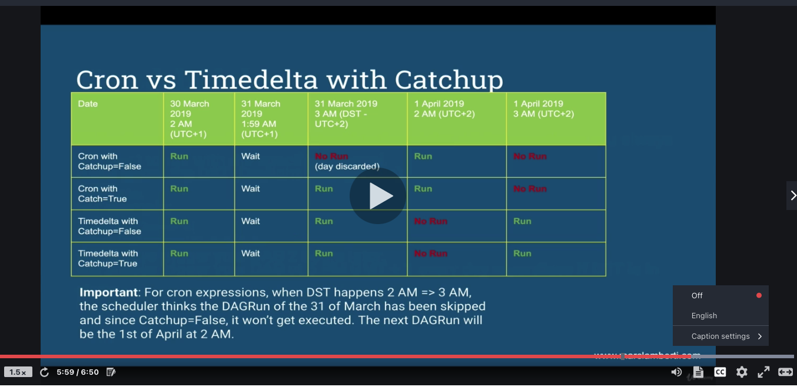
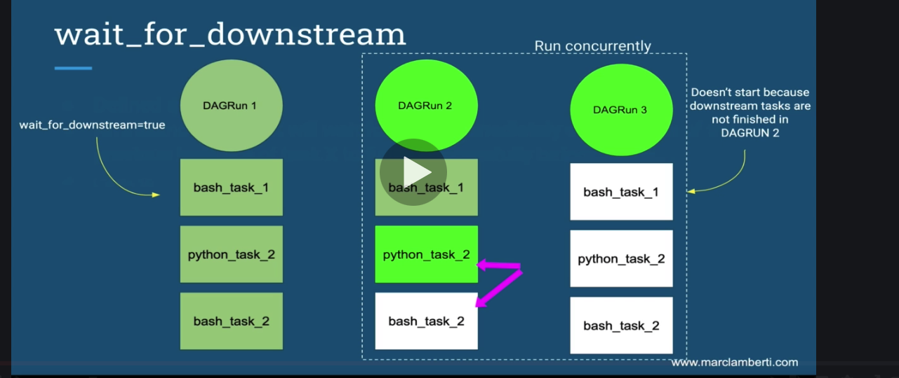
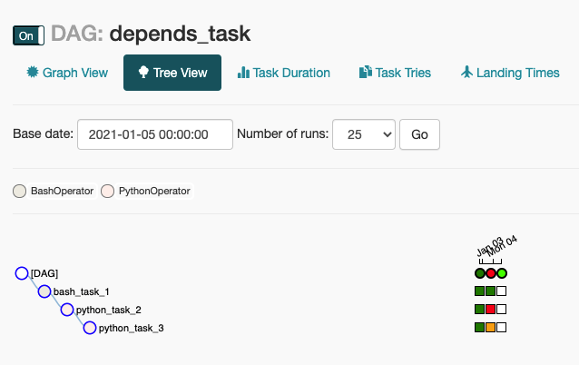
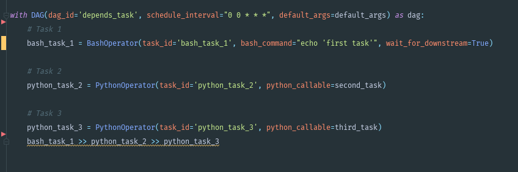
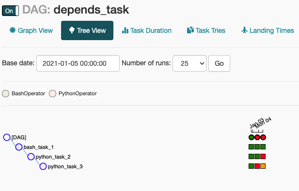
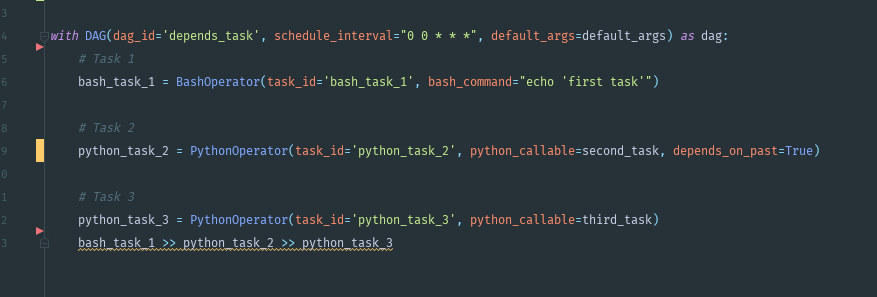

__What is airflow?__
programatically author and monitor data pipelines

Core components of airflow:
- unicorn server and flask and serves the UI dashboard
- scheduler: Daemon responsible for scheduling jobs.
- metadata database: all metadata related to admin and jobs  and must be supported by sqlalchemy library (mysql, oracle, postgres)
- executor: how tasks should be executed (kubernetes executor, local executor, etc.)
- worker: node in cluster executing our tasks.


Key concepts:
- DAG: acyclic graph object representing our data pipeline
- Operator: describes a single task in a DAG
- Task: instance of an operator.
- TaskInstance: represents a specific run of a task = DAG + task + point in time.
- worker node: computer
- worker: process of airflow


_What airflow gives you:_
- pipelines are configured via python code
- you have a graphical representation of your DAGs as well as metrics.
- Airflow is scalable with horizontally or vertically. 
- you can backfill and run a past task that failed. 
airflow is  NOT a data streaming solution. It's not spark or storm.
  

How airflow works:


- The queue is needed to execute tasks in the right order.
- in the diagram above, the executor, scheduler, web server are on the same node. The database is separate so in that in thee case of a machine failure, the database is still up and running. 
- The executor, scheduler, web server work together by exchanging data through the database.


This diagram is if you scale out airflow on many workers. The worker nodes contain the executors.

Steps of airflow:
- scheduler reads the DAG folder for a python file corresponding to a DAG
- dagrun object is created based on dag. It's an instance of our dag with state set to running.
- task instance is created and flagged to "scheduled" in the database.
- scheduler picks off task instances form hte database marked as "scheduled" and puts and changes state to queued and sends them to executors's queues. Remember, the queues are part of the executors. 
- executors task pulls tasks from queue and turn state from queued to running
- workers start processing the task instances.
- executor finishes task and sets task to finsihed in database.
- scheduler updates dag run to success if succeede or failed
- web server periodically pulls data from database to update the UI≥


__Basic commands:__

airflow initdb
	- When you change the database or install airflow for the first time:


airflow resetdb
	- Lose all data, fresh new install


airflow upgradedb
	- Upgrades metabase to new version
	- Initdb calls upgradedb


airflow webserver
	- -w can specify number of unicorn workers


airflow list_dags
	- list all dags that the scheduler is aware of.


airflow trigger_dag <dag_name>
- you need to first turn on the dag in the UI. This tells the scheduler that DAG can run.

airflow list_tasks <dag_name>


To clear a dag run:
- turn off toggle in UI so scheduler won't schedule it.
- click on `browse` in UI, type in dag you want to clear, select all associated tasks, and select clear.


It's neat to see that the execution is the day before:

```bash
DAG RUNS
------------------------------------------------------------------------------------------------------------------------
id  | run_id               | state      | execution_date       | state_date           |

6   | manual__2021-03-24T16:29:05.970723+00:00 | success    | 2021-03-24T16:29:05.970723+00:00 | 2021-03-24T16:29:05.976863+00:00 |
8   | scheduled__2021-03-23T00:00:00+00:00 | success    | 2021-03-23T00:00:00+00:00 | 2021-03-24T16:31:31.808686+00:00 |
7   | scheduled__2021-03-22T00:00:00+00:00 | success    | 2021-03-22T00:00:00+00:00 | 2021-03-24T16:29:50.303460+00:00 |
```

So if you trigger a dag, it runs immediately and I guess it records that it was run the day before at midnight.


### Chapter 3

- forex data pipeline will be built.


What is a DAG?
- finite directed graph with no directed cycles i.e., cannot wind up back at original nodel. no loops
- The Dag cannot be endless.

In airflow:
- Dag is a collection of tasks to schedule as well as their dependencies.
- node = task
- edge = dependency between N tasks.


If your start date is 1 year ago and your `schedule_interval` is daily, you'll wind up with 365 Dag runs.


these are the steps in writing a Dag:


__Operators__
To create an Airflow task, you need to create an operator

an operator says what actually gets done in a task.
- usually atomic, doesn't need to share resources with any other operators.
- can be on separate machines.
- Dag defines what order the operators are run.
- can trigger single task from CLI

key points:
- defines single task
- idempotent, same result no matter how many times run.
- task is defined by instantiating Operator class.
- when Operator is instantiated, it becomes node in Dag.


some default operators:
- BashOperator - executes a bash command
- PythonOperator - calls arbitrary python function.
- EmailOperator - sends an email

- All operators inherit from Base Operator
- There are 3 types:
    - Action Operators: perform an action (BashOperator, PythonOperator, EmailOperator)
    - Transfer Operators: move data from 1 system to another (StfpOPerator)
    - Sensor Operators: waiting for something to happen (FileSensor)
    
- TransferOperators: do not use if dealing with large data. Data pulled from source, staged on machine where executor is running, then transferred. 
- SensorOperator: you need to overwrite the `poke` method. It runs until it returns True. It's a long-running task.

- use bitwise operators to coordinate dags

-when you trigger a dag run on the airflow webpage, why do 2 dag runs get triggered? The first one is the one that airflow runs automatically based on the start date. Sinbce catchup = False, Airflow only triggers one based on most recent date. and the second one is the one we manually create when we click the button.

### Chapter 4
- start date: the start date from which the tasks of the DAG can be scheduled and triggered. Ex: if you define it from 30th of March 2019, it will be scheduled on the 30th of march at midnight.
- schedule_interval: corresponds to the interval of time from the min start_date at which you want to get DAG triggered. If you don't specify this, it runs every day.

Once the DAG is triggered, a DAGRun is launched with an execution date.
**DAGRun** 
- instance of DAG at a given time.
- when a DAG is triggered, it creates a DAGRun object and describes an instance of a DAG at a given time.
- Schedule creates a DAGRun object.

**execution date** 
- does not correspond to when DAG is run. It is not the date that which the DAG is run. It's the beginning of the period you want your DAG to process data from. start date - schedule interval. execution date is not when DAG is run. It's when it was executed but it will not run until the schedule interval has passed. 



- DAGs are configured in UTC btw.

So if your dag looks like this:



the "0 * * * *" means the schedule interval is every hour.

And you set your world clock to 3/29 and 9pm, then it will run since UTC is +4 from EDT (during daylight savings). It actually won't run since we scheduled the dag to run at 11 scheduled interval past 1am and since 9pm EDT = 1pm UTC it doesn't run. When we change the clock to 10pm EDT = 2pm UTC, then the dag runs with a time of 2:03pm UTC and an execution time of 1pm UTC.



If you hover over the info icon in the UI, it has the actual run time which should be one scheduled_interval ahead of the execution date which should be one scheduled_interval behind the start time.  

**Catchups**
- if you pause your DAG and `catchup=true`, then your dag run will run all of the dags it should have run with the same start date but with an execution date corresponding to all the days they were supposed to be executed. See below:
- if catchup=False, then only most recent DAG run will be run and catchup DAG runs will not be run. if you DAG runs every day at midnight and you change your comp clock to 8 days in the future, only 1 DAG run will occur... the most recent one. The execution date will read the day before the day you changed your clock to at midnight.



These catchups only occur if Catchup is set to `True`.

- if you want your DAG to run at 5pm in your local time zone, DST should not change that. So you need to use UTC because DST does not affect UTC time.
- when you create datetime object, always use a timezone specification, even if it is UTC.
- always store in UTC.
- if you use cron, it will ignore DST and always run at the specified time. For example: schedule_interval= 0 5 * * * will always trigger your DAG at 5 PM GMT + 1 every day regardless if DST is in place or not. That's one benefit of using cron here.
- if you use timedelta, airflow will try to keep the interval. for example, if you have `timedelta(hours=2)`, will always trigger your DAG 2 hours later.
 

this chart gives a good summary:

 


- by default DAG is in UTC time. `start_date` in default args must be set in UTC. If you want to start dag 5pm EST, I have to set the DAG `start_time` to 9pm UTC.
- remember that python's `datetime` gives naive datetime objects by default, which means no associated time zone.

- if your have a DAG that runs on this interval: `schedule_interval="0 1 * * *",` (remember this is in UTC), then on DST, the local time changes to one hour later or earlier. So how do we fix this?

first:
- `'start_date': datetime(2021, 3, 29, 2, tzinfo=local_tz),`
- change ` schedule_interval="0 2 * * *"` so that DAG runs every day at 2am local time.


**How to make tasks dependent**
- `depends_on_past`, defined at task level. says if previous task failed in a previous DAGRun, the next time the task is not run at all.
- consequent DAGRuns says that the task has no status.
- `wait_for_downstream` says task will wait until tasks immediately downstream of it (run after it) are finished. If say Task1 has the `wait_for_downstream=True` flag, then if a task after it has failed in a previous Dagrun, Task1 will not run. See diagram:



`wait_for_downstream` is useful when you have multiple dag runs working on same asset X and tasks downstraem also use X. if two dagRuns are run concurrently, this is useful. If a dag run does not want to work with old data, this might be useful.

-if you mark task1 with `wait_for_downstream=True` and task2 fails in a previous DAGRun, then task1 will not run in the next DAGRun. This is what the tree_view looks like:



this is what the code would look like:



- if the second task has a `depends_on_past=True`, and it has an error, your tree view in airflow will look like this:


- notice the orange square. Our code looks like this:



The difference between these two is that if task2 is marked with `depends_on_past=True` and task2 in a previous DAGRun failed, task2 does run in the next dagrun. 
- if task1 is marked as `wait_for_downstream=True` and task2 fails in a previous DAGRun, task1 does not run in the next DAGRun.G


**DagFolder structure**
- `dags_folder` in airflow.cfg is where all dags are kept. by default, airflow will use path from `$AIRFLOW_HOME/dags`
- use a zip. This is one way to combine dags with dependencies. Dags need to be at root level of zip file otherwise airflow cannot load them. If you urn airflow, you should see the dag from the zip file in your DAGS section of your airflow UI. Using zip files and pip, you can include module dependencies for your dags into the zip folder. the dependencies would be a zip folder as well.
- or DagBag, a collection of DAGs parsed out of a folder tree and has high-level config settings. YOu can load your DAGs from different folders and not the one set by default. In order to use this feature, we need a special Python file.
- one downside of DAGBag approach is that you cannot see errors in your UI. If you remove an import, the UI shows no error, but you have to check logs from server or docker container.
- whatever you put in `.airflowignore` will be ignored by Airflow.
- remember that `__init__.py` makes python treat directories as modules. It's also first file to be loaded so you can use it to execute code. You need this file to import functions from a file.